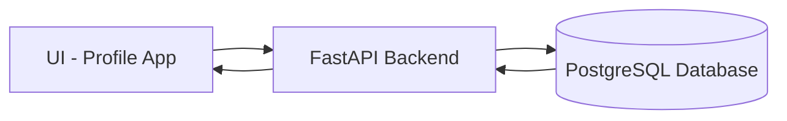

# System Design: profile_app

---

## Goal
A simple full-cycle system:
UI → API (FastAPI) → PostgreSQL → API → UI

## Core Components

### 1. UI (Simple Form Layer)
**Collect:**
* name
* age

**Responsibilities:**
* Send data to backend
* Display responses

**Trigger actions:**
* Register
* View profile
* Update profile
* Delete account

### 2. Backend (FastAPI)
**Responsibilities:**
* Acts as the logic layer

**Handles:**
* register user
* fetch user profile
* update user profile
* delete user

It does NOT store data (database does)

### 3. Database (PostgreSQL)
**Responsibilities:**
* Persistent storage
* Table: users

**Conceptually:**
id | name | age

# System Action Flow

| Action         | Flow                                                     |
| -------------- | -------------------------------------------------------- |
| Registration   | UI → POST /register → API → INSERT DB → response → UI    |
| View profile   | UI → GET /user/{id} → API → SELECT DB → response → UI    |
| Update profile | UI → PUT /user/{id} → API → UPDATE DB → response → UI    |
| Delete account | UI → DELETE /user/{id} → API → DELETE DB → response → UI |

## Backend Endpoint Structure (concept only)

| Action | Endpoint | DB Action |
| :--- | :--- | :--- |
| Register | POST /register | INSERT |
| View | GET /user/{id} | SELECT |
| Update | PUT /user/{id} | UPDATE |
| Delete | DELETE /user/{id} | DELETE |

## UI (Simple — no CSS focus)

You only need:

**Page 1: Form**
* Input: Name
* Input: Age
* Button: Register

**Page 2: Profile View**
* Show name
* Show age
* Buttons:
    * Update
    * Delete

**Page 3: Update Form**
* Edit name
* Edit age
* Save button

## Key Design Idea
* UI = input/output only
* API = logic
* DB = storage
