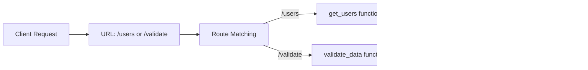

```js
Routes (endpoints)

• A route maps a URL → a specific function in your backend

• When a client (browser, app, API caller) hits a URL:
  • The framework checks: “Which function handles this URL?”
  • Then it runs that function

• Example:

  • /users
    → Calls a function like: get_users()
    → Returns list of users

  • /validate
    → Calls a function like: validate_data()
    → Processes and returns validation result

• Mental model:
  • URL = trigger
  • Route = mapping
  • Function = execution

• Flow:
  • Client requests /users
  • Route matches /users
  • Corresponding function runs
  • Function returns response


```
